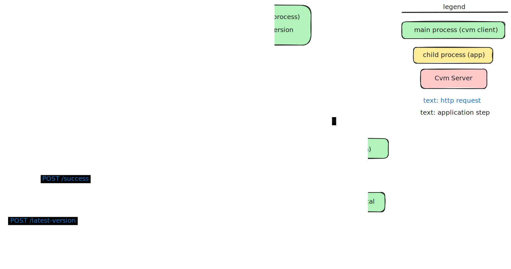

# cvm
Client version manager that replaces a running app with a new version

The cvm (Client Version Manager) does the following with executable process:
1. Retrieve a compiled app from the cvm_server.
2. Run the app until a new version is found.
3. Stop the old version and begin the process again using the new version from step 1.

The cvm_server has makefile to setup and seed the database with a test application. The test application was generated using ../infinite_hello.

The Makefile in the root directory runs the cvm_server and then the cvm_client integration tests.
