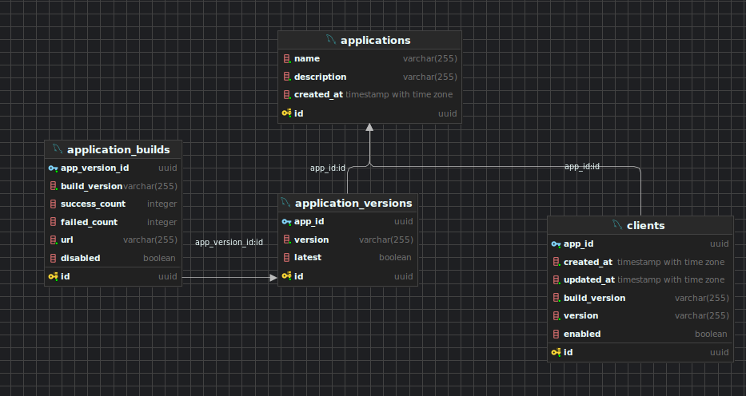

# CVM SERVER
CVM server that responds to CVM clients. When a client starts, it will call the server to get the latest version. 
This server will respond to the client with the latest version of the app and the url to retrieve that version.

## Endpoints
### Create Application
   - HTTP Method: POST
   - Endpoint: /applications
   - Description: Creates a new application record in the app store.
   - Request Body:
```json
  {
    "name": "string",
    "description": "string"
  }
```
   - Response: On success, returns the details of the created application.
```json
  {
    "id": "uuid",
    "name": "string",
    "description": "string"
  }
```
- Error: Returns an error StatusCode and error message.
---

### Get Latest Version
   - HTTP Method: POST
   - Endpoint: /applications/latest-version
   - Description: Retrieves the latest version details of an application for a specific client.
   - Request Body:
```json
  {
    "client_id": "uuid",
    "app_id": "uuid",
    "current_running_version": "string",
    "architecture": "x86_64-pc-windows-gnu | x86_64-unknown-linux-gnu"
  }
```
- Response: On success, returns the latest version details.

```json
  {
    "build_id": "uuid",
    "version": "string",
    "url": "string",
    "update_required": true | false
  }
```
---
### Report Build Success
- HTTP Method: POST
- Endpoint: /builds/success
- Description: Reports a successful build for a client.
- Request Body:
```json
  {
    "client_id": "uuid",
    "app_id": "uuid",
    "current_running_version": "string",
    "architecture": "x86_64-pc-windows-gnu | x86_64-unknown-linux-gnu"
  }
```
- Response: On success, returns an empty JSON object.
---
### Report Build Failure
- HTTP Method: POST
- Endpoint: /builds/failure
- Description: Reports a failed build for a client.
- Request Body:
```json
  {
    "client_id": "uuid",
    "app_id": "uuid",
    "current_running_version": "string",
    "architecture": "x86_64-pc-windows-gnu | x86_64-unknown-linux-gnu"
  }
```
- Response: On success, returns an empty JSON object.
---
### Health Check
- HTTP Method: GET
- Endpoint: /health
- Description: Provides a simple health check endpoint to verify the service is running.
- Response: On success, returns an empty JSON object.
---
### Enums
Architecture
The supported architecture options are:
x86_64-pc-windows-gnu
x86_64-unknown-linux-gnu
This is used in requests to specify the client's platform.
---
### JSON Key Glossary
UUID: A unique identifier, commonly represented as a string in the format "550e8400-e29b-41d4-a716-446655440000".
StatusCode: HTTP Status Codes (200, 400, 500, etc.) indicating success or error.

### Database Design
